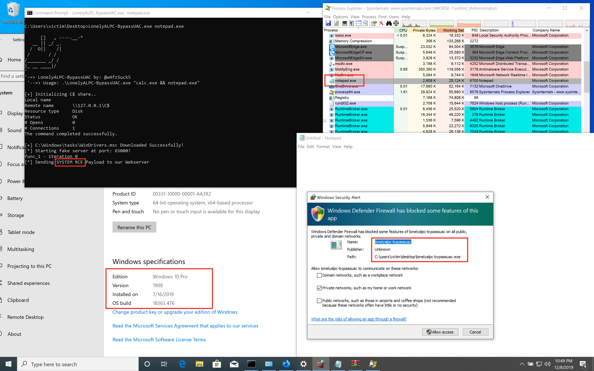
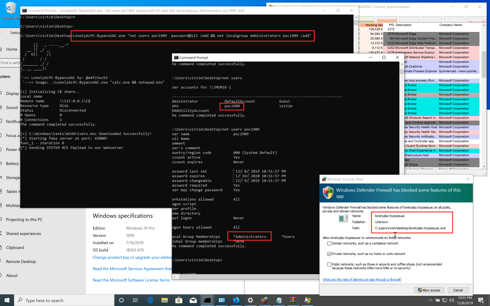

# LonelyALPC-BypassUAC
# ATTENTION! This script will not work until you change [[Link Text]([ALPC-BypassUAC.cpp#L171C2](Lonely-alpc-mmc-uac-bypass/ALPC-BypassUAC/ALPC-BypassUAC.cpp#L171C2)] for your personal Link (it must return a b64 for your C:\\Windows\\tasks\\WinDrivers.msc
Lonely x64 binary to Bypass Win10 UAC utilizing ALPC (mmc) method with **[command line]** !
**Tested on Win10 1809 and 1909** 

Usage: **.\LonelyALPC-BypassUAC.exe "calc.exe && notepad.exe"** 

These commands will be run as SYSTEM Privileges

NOTES:
Thanks to **[DimopoulosElias]** for the original exploit
**https://github.com/DimopoulosElias/alpc-mmc-uac-bypass** 

I didn't implemented any powershell module with base64 encoding or binary unpacking.. the method which i'm utilizing at now  is by using get-system.ps1 and executing it module via IEX from: 
**https://github.com/HarmJ0y/Misc-PowerShell/blob/master/Get-System.ps1** 

Also, i didn't binary unpacking or base64 enconding for the **.msc** file, which is ran by **mmc.exe**  service. That .msc file after all is necessary to turn this service on to be accessible by our fake webserver and perform code execution.

**EXAMPLE (Updated 08/12/2019):**

**SYSTEM - NOTEPAD.exe:**

**ADD ADMIN USER**

