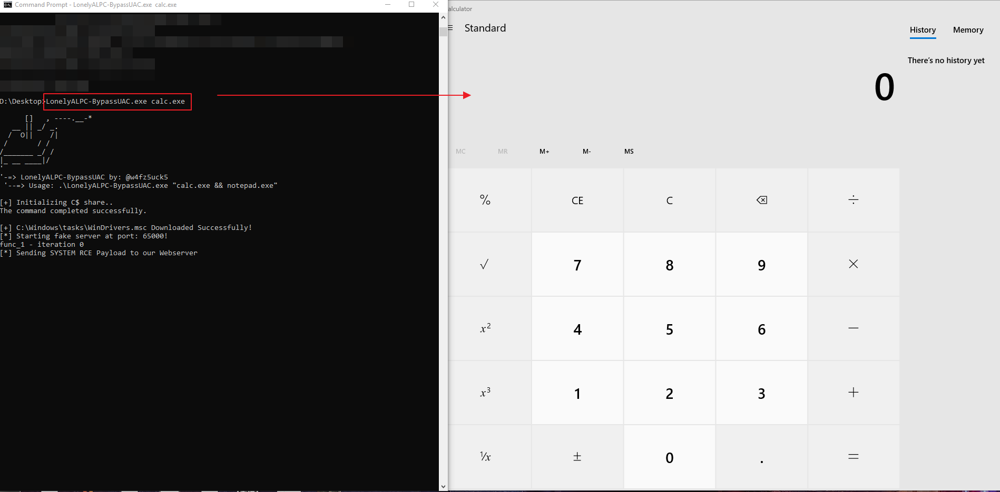
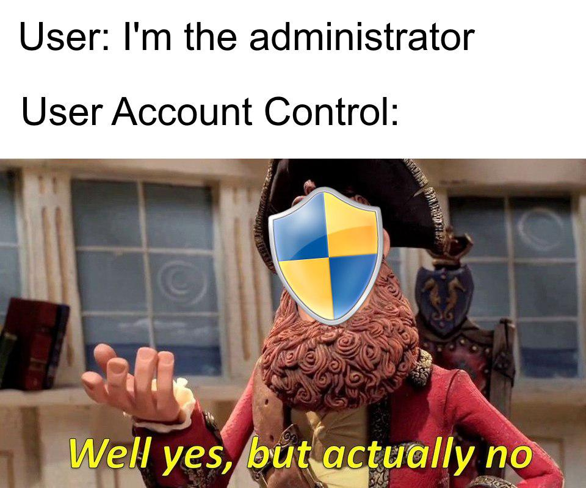

# LonelyALPC-BypassUAC
Lonely x64 binary to Bypass Win10 UAC utilizing ALPC (mmc) method with **[command line]** !
**Tested on Win10 1809** 

Usage: **.\LonelyALPC-BypassUAC.exe "calc.exe && notepad.exe"** 

These commands will be run as SYSTEM Privileges

NOTES:
Thanks to **[DimopoulosElias]** for the original exploit
**https://github.com/DimopoulosElias/alpc-mmc-uac-bypass** 

I didn't implemented any powershell module with base64 encoding or binary unpacking.. the method who i utilize get-system.ps1 was done by executing it module via IEX by this url: 
**https://github.com/HarmJ0y/Misc-PowerShell/blob/master/Get-System.ps1** 

Also, i didn't binary unpacking or base64 enconding for the **.msc**  file, which is run by **mmc.exe**  service, it .msc file is necessary to make this service access our fake webserver and run code.

**EXAMPLE:**

